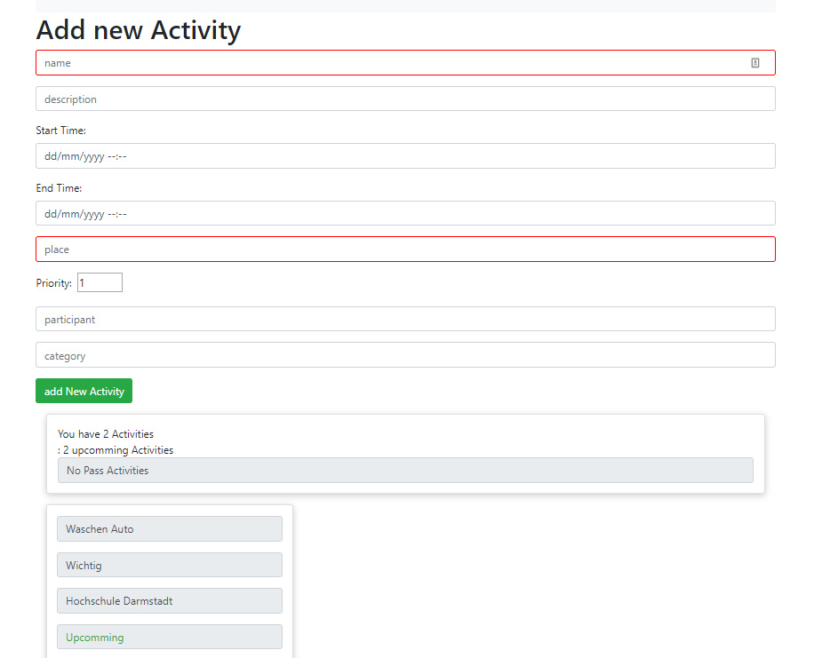
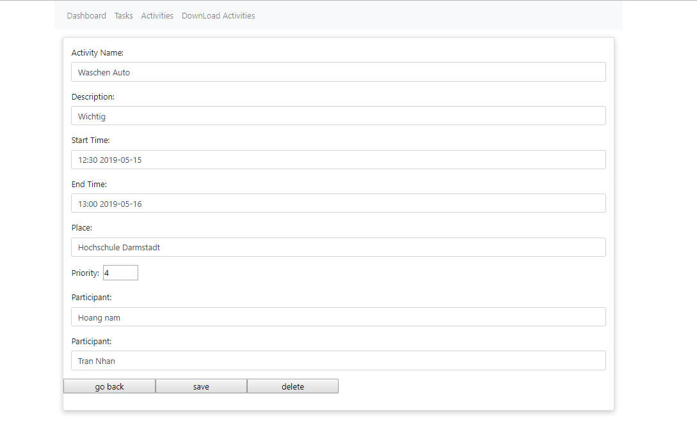

# FWE-SS19-754346-HA2
# Activity Planner Frontend

The aim of this application is to carry out activities which we would like to carry out soon.

## Getting Started
- You can Create, Read, Update and Delete planner with this app
### Prerequisites
What things you need to install the software and how to install them?  
- [Node.js](https://nodejs.org/docs/latest/api/)  
- [npm](https://www.npmjs.com/package/npm-api)
- [express](https://expressjs.com/de/api.html)
- [MongoDb](https://mongoosejs.com/)
- [Angular](https://angular.io/guide/quickstart)
### Installing 
- Clone the project from gitlab  
```sh
$ git clone https://code.fbi.h-da.de/istmtnguy/fwe-ss19-754346-ha2.git
```
- Go the the folder
```sh
cd fwe-ss19-754346-ha2/myTodoApp
```
- Install all dependencies
```sh
$ npm install
````
## Usage  
- Start program  
- Download, readme read and run Backend from HA1
- [Link To Backend](https://code.fbi.h-da.de/istmtnguy/fwe-ss19-754346-ha1)
 - URIs Backend relative to http://localhost:3000/api
 - Now you can start Angular Frontend
 ```sh
 ng serve --open
 ```
  - URIs Frontend relative to http://localhost:4200/dashboard  
  The program has following endpoints:
   - From Taskbar you can see: Dashboard, Task, Activities, Download Activities  
1. Click "Download Activities" : you can download all activities with file data ".csv" on your computer
2. Click "Activities" : Link to Seite "activityPlanners". you can see all activities, amount current, pass, upcomming activities with name, description, place and status of activity and create new "Activity" hier.  
Note: feld require : name, start Time, end Time, place.  

3. Click on each activity : Link to activity dateil. you can Read, Change and Delete all information of this activity.  

4. each action you can see "message".
 - Error Handler: If any action is not possible, it will test the message on the screen
 - Offline Function  : Suppose the client is editing / add 1 user. Users press submiit.
                       Now use Angular to call the backend.
                         Check respone returns if the server error message will switch to save the result temporarily
                         into the cache like Chrome's Local storage.
                       When the server is alive, it will check in local storage first, if there is a copy, it will automatically update serve
                       The card informs the client about this caching.
                       but it must be stated that not storing important things on local storage
                       This generally does not encourage this
                       It is only a temporary fire when the user has entered a lot of information.
 